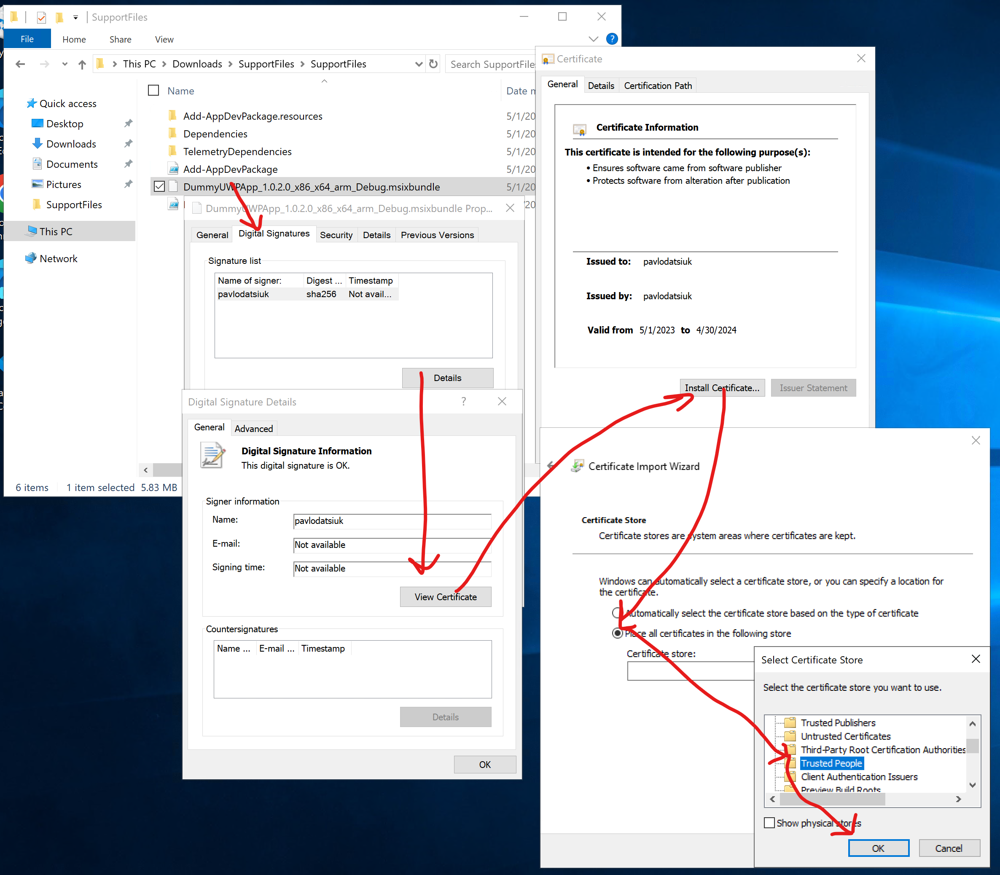
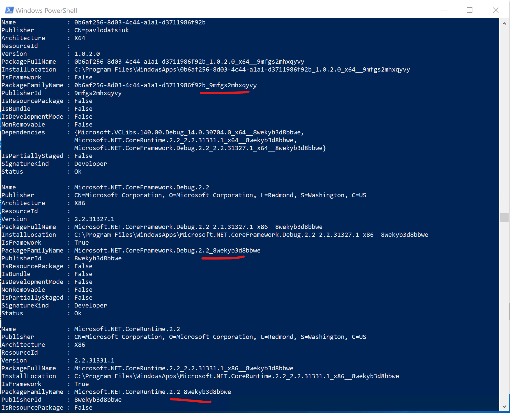

# Introduction
Universal Windows Platform (UWP) is a development framework that allows developers to create applications running across various Windows 10/11 devices, such as PCs, tablets, smartphones, and even Xbox consoles. Although installing UWP apps on Windows Server 2019 and 2022 can be challenging because of the absence of the Microsoft Store, this blog post will walk you through installing it using PowerShell.

# Prerequisites
1. Windows Server 2019 or 2022
1. PowerShell
1. Support files 
1. Your msixbundle

# Steps
## Step 1: Obtain Support Files
There is a lack of several required DLLs in your msixbundle; to overcome it, you should be placed them alongside your msixbundle before running so that you can proceed with your installation process. There are two ways to get these files: [package your blank/dummy UWP project in Visual Studio](https://learn.microsoft.com/en-us/windows/msix/package/packaging-uwp-apps) or download them from my [GitHub repo](https://github.com/JTOne123/UWPOnServ19).


## Step 2: Extract Support Files and put msixbundle there
Extract the contents of [SupportFiles.zip](https://github.com/JTOne123/UWPOnServ19/blob/main/SupportFiles.zip) and place the msixbundle file into the same folder.

## Step 3: Run Install.ps1 in PowerShell
Execute the .\Install.ps1 script using PowerShell. If this is your first time running the script, there is a possibility that you could come across a certificate problem.


## Step 4: Install the Certificate
There are two options for installing the certificate: Install it manually or place it alongside your bundle.

### Manual installation
You must export and install the certificate from your msixbundle in the certificate store.


Follow the instructions at https://docs.microsoft.com/en-us/appcenter/distribution/installation to install the certificate to Local Machine -> Trusted People.

### Auto installation
You have to approve that you agree to install the certificate, and that's it.


## Step 5: Re-execute Install.ps1 and Activate Developer Mode
Return to the PowerShell terminal and re-run the Install.ps1 script. An error regarding the developer license will appear. In the window that opens, select Developer mode.


## Step 6: Finalize Installation
Complete the installation process. Once finished, you can access your app from the start menu.


## (Optional) Step 7: Enable Loopback Exemption for Local Setup
Suppose you want to run UWP app on your backend development environment and connect to the backend locally. In that case, you must enable the loopback exemption for UWP.

a) Use the PowerShell cmdlet to obtain the PackageFamilyName of the UWP app on your computer:
```powershell
Get-AppxPackage -Name YourCompany.YourUWPAppName | ForEach-Object{ $_.PackageFamilyName }
```
If you aren't sure about the company name or actual app name, you can look through a complete app list with the Get-AppxPackage command without parameters.


b) Enable the exemption using the command line or the same PowerShell window; please replace YourCompany.YourUWPAppName_1111111111111 with your PackageFamilyName:
```powershell
checknetisolation loopbackexempt -a -n="YourCompany.YourUWPAppName_1111111111111"
```

In conclusion, I hope this article has provided more clarity than confusion. Please follow me for exciting future reads.